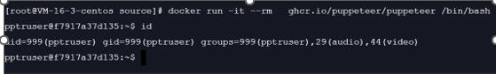

1.首先 创建一个临时容器，退出后自动删除该容器

docker run -it --rm   ghcr.io/puppeteer/puppeteer /bin/bash

看到容器内的用户id999和用户组999

Exit 退出容器

2.创建项目目录 /root/app/JD-ProtectPrice-JingDou-Express
该目录的权限是root用户
 chown -R 999:999  /root/app/

docker run -it --rm --volume  /root/app/JD-ProtectPrice-JingDou-Express:/app  --workdir /app  --name  JD-ProtectPrice-JingDou-Express  ghcr.io/puppeteer/puppeteer:latest   /bin/bash

创建容器后进入 bash，然后执行 node index.js 运行宿主机目录 JD-ProtectPrice-JingDou-Express下的项目 但是会提示找不到 puppeteer

因为 ghcr.io/puppeteer/puppeteer:latest 镜像中将
puppeteer 安装在了/home/pptruser/node_modules 目录下

==============
pptruser@3bc4f29090b4:/app$ find / -name puppeteer
find: '/root': Permission denied
/home/pptruser/node_modules/puppeteer-core/lib/esm/puppeteer
/home/pptruser/node_modules/puppeteer-core/lib/cjs/puppeteer
/home/pptruser/node_modules/puppeteer
/home/pptruser/node_modules/puppeteer/lib/esm/puppeteer
/home/pptruser/node_modules/puppeteer/lib/cjs/puppeteer
/home/pptruser/.cache/puppeteer
find: '/etc/ssl/private': Permission denied
find: '/proc/tty/driver': Permission denied
find: '/var/cache/apt/archives/partial': Permission denied
find: '/var/cache/ldconfig': Permission denied
pptruser@3bc4f29090b4:/app$ exit
exit
==================
查看容器中npm 配置项目
pptruser@e61b21be7fff:/app$ npm config get prefix
/usr/local
pptruser@e61b21be7fff:/app$ cd /usr/local/
pptruser@e61b21be7fff:/usr/local$ ls
CHANGELOG.md  LICENSE  README.md  bin  etc  games  include  lib  man  sbin  share  src
pptruser@e61b21be7fff:/usr/local$ cd lib
pptruser@e61b21be7fff:/usr/local/lib$ ls
node_modules  python3.9
pptruser@e61b21be7fff:/usr/local/lib$ cd node_modules/
pptruser@e61b21be7fff:/usr/local/lib/node_modules$ ls
corepack  npm
pptruser@e61b21be7fff:/usr/local/lib/node_modules$
=====================
为什么： puppeteer 安装在了/home/pptruser/node_modules 目录下
因为在Dockerfile中 
WORKDIR /home/pptruser

COPY puppeteer-latest.tgz puppeteer-core-latest.tgz ./
已经将当前的puppeter项目的代码拷贝到了 /home/pptruser 目录下了

pptruser@e61b21be7fff:~$ pwd
/home/pptruser
pptruser@e61b21be7fff:~$ ls
THIRD_PARTY_NOTICES  node_modules  package-lock.json  package.json
pptruser@e61b21be7fff:~$
从上面我们看到 ppt用户的家目录下有一个node_modules，该目录下有puppetter依赖

又因为Nodejs模块查找

当  require  遇到一个既不是核心模块，又不是以路径形式表示的模块名称时，会试图
在当前目录下的  node_modules  目录中来查找是不是有这样一个模块。如果没有找到，则会在当前目录的上一层中的  node_modules  目录中继续查找，反复执行这一过程，直到遇到根目录为止。举个例子，我们要在 /home/byvoid/develop/foo.js 中使用  require('bar.js')  命令，Node.js会依次查找： 
  /home/byvoid/develop/node_modules/bar.js  
  /home/byvoid/node_modules/bar.js  
  /home/node_modules/bar.js  
  /node_modules/bar.js  

docker 如何挂载到用户家目录

因此 创建容器 将代码目录挂载到 ppt用户家目录下
docker run -it --rm --volume  /root/app/JD-ProtectPrice-JingDou-Express:/home/pptruser/app -p 12000:3000 --workdir /home/pptruser/app  --name  JD-ProtectPrice-JingDou-Express  ghcr.io/puppeteer/puppeteer:latest   /bin/bash

3.创建正式的容器 

docker run -d --volume  /root/app/JD-ProtectPrice-JingDou-Express:/home/pptruser/app -p 12000:3000 --workdir /home/pptruser/app  --name  JD-ProtectPrice-JingDou-Express  ghcr.io/puppeteer/puppeteer:latest   node index.js

